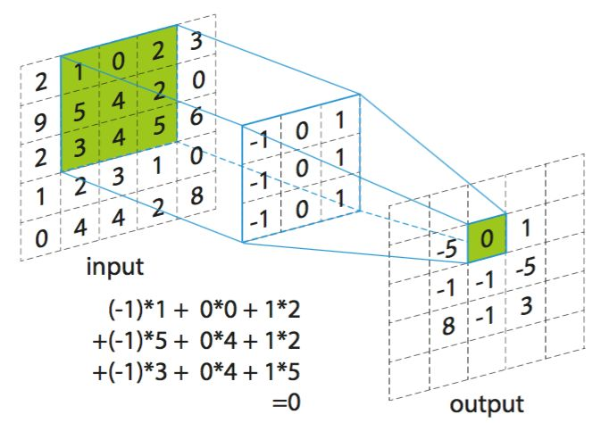
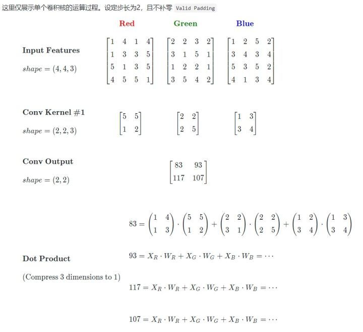
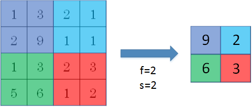
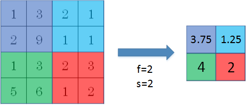

# 1.环境安装 
- 安装 Miniconda  
  https://mirrors.tuna.tsinghua.edu.cn/anaconda/miniconda/Miniconda3-latest-Windows-x86_64.exe
- 运行 Anaconda Prompt (Miniconda3)

- 设置conda代理  
	conda config --add channels https://mirrors.tuna.tsinghua.edu.cn/anaconda/pkgs/free/  
	conda config --add channels https://mirrors.tuna.tsinghua.edu.cn/anaconda/pkgs/main/  
	conda config --set show_channel_urls yes

- 设置pip代理  
	pip config set global.index-url https://pypi.tuna.tsinghua.edu.cn/simple

- 安装tensorflow  
	conda install tensorflow-gpu

- 更新  
	conda update --all  

- [测试环境](1_env.py)

# 2.神经网络计算过程

## 2.1 当前人工智能主流方向-连接主义
仿生学，模仿神经元连接关系  
MP模型  
  
为了求解简单，去掉非线性函数得到  
Y = W * X + b

## 2.2 前向传播
给定X计算出Y

## 2.3 损失函数
预测值y与标准值y_之间的差距  
损失函数可以定量判断W、b的优劣，
当损失函数值最小时，参数W、b会出现最优值  
损失函数定义有多种方法 均方误差MSE

## 2.4 梯度下降
目的：寻找一组参数W、b使得误差函数最小  
梯度：函数对各参数求偏导后的向量 函数梯度下降方向就是函数减小方向
梯度下降法：沿损失函数梯度下降方向，寻找损失函数最小值，得到最优参数的方法  
计算公式  

## 2.5 学习率
lr设置过小时，参数更新过程缓慢 
lr设置过大时，梯度可能在最优值左右来回震荡

## 2.6 反向传播更新参数
从后向前，逐层求损失函数对每层参数的偏导数，迭代更新所有参数

[示例](2_back_propagation.py)

## 2.7 常用函数 
- 张量定义  
tf.constant(
	value, dtype=None, shape=None, name='Const'
)

- 转换为张量  
tf.convert_to_tensor(
	value, dtype=None, dtype_hint=None, name=None
)

- 填充张量  
tf.zeros(
	shape, dtype=tf.dtypes.float32, name=None
)  
tf.ones(
	shape, dtype=tf.dtypes.float32, name=None
)  
tf.fill(
	dims, value, name=None
)

- 正态分布随机张量  
tf.random.normal(
	shape, mean=0.0, stddev=1.0, dtype=tf.dtypes.float32, seed=None, name=None
)

- 截断式正态分布随机张量  
tf.random.truncated_normal(
	shape, mean=0.0, stddev=1.0, dtype=tf.dtypes.float32, seed=None, name=None
)

- 均匀分布随机张量  
tf.random.uniform(
	shape, minval=0, maxval=None, dtype=tf.dtypes.float32, seed=None, name=None
)

- 乱序  
tf.random.shuffle(
    value, seed=None, name=None
)

- 类型转换  
tf.cast(
	x, dtype, name=None
)

- 数学运算  
    - 算术运算，对张量对应元素进行算术运算   
    add\subtract\multiply\divide\square\pow\sqrt...    
    tf.math.ag(x, y, name = None)

    - 压缩运算，对张量指定方向进行压缩运算 
    axis 压缩维度
    any\max\mean\min\prob\std\sum\variance  
    tf.math.reduce_ag(
    input_tensor, axis=None, keepdims=False, name=None
    )

- 归一化指数函数  
tf.math.softmax(
    logits, axis=None, name=None
)

- 独热码  
tf.one_hot(
    indices, depth, on_value=None, off_value=None, axis=None, dtype=None, name=None
)

- 将变量标记为可训练  
tf.Variable(
    initial_value=None, trainable=None, validate_shape=True, caching_device=None,
    name=None, variable_def=None, dtype=None, import_scope=None, constraint=None,
    synchronization=tf.VariableSynchronization.AUTO,
    aggregation=tf.compat.v1.VariableAggregation.NONE, shape=None
)

- 矩阵乘法  
tf.matmul(
    a, b, transpose_a=False, transpose_b=False, adjoint_a=False, adjoint_b=False,
    a_is_sparse=False, b_is_sparse=False, name=None
)

- 输入特征、标签配对  
tf.data.Dataset.from_tensor_slices(
    tensors
)

## 2.8 鸢尾花分类实现
- 安装依赖  
    conda install scikit-learn

  [实现](2_iris.py)

# 3.神经网络优化

## 3.1 预备知识
- 条件函数 条件成立时返回x中的元素，否则返回y中的元素    
tf.where(
    condition, x=None, y=None, name=None
)  

- 随机数 [0, 1)区间的随机数  
numpy.random.RandomState.rand(d0, d1, ..., dn)

- 数组叠加  
numpy.vstack(tup)

## 3.2 神经网络复杂度
- 空间复杂度
    - 层数 隐藏层数+输出层
    - 参数个数 总w + 总b

- 时间复杂度
    - 乘加运算次数

## 3.3 指数衰减学习率
    lr = LR_BASE * LR_DECAY ** (epoch / LR_STEP)

## 3.4 激活函数
对于神经网络中的每个计算单元有 Y = f(X*W + b)  
函数f称为激活函数 通过激活函数，可以计算非线性问题

- Sigmoid激活函数  
tf.nn.sigmoid(
    x, name=None
)  
表达式 f(x) = 1 / ( 1 + e^x)  
特点
    - 易造成梯度消失
    - 输出非0均值，收敛慢
    - 幂运算，训练时间长

- Tanh激活函数  
tf.nn.tanh(
    x, name=None
)  
表达式　f(x) = (1 - e^(-2x)) / (1 + e^(-2x))  
特点
    - 均值为0
    - 易造成梯度消失
    - 幂运算，训练时间长

- Relu激活函数  
tf.nn.relu(
    features, name=None
)  
表达式 f(x) = max(x, 0)  
优点
    - 解决梯度消失问题(在正区间)
    - 计算速度快
    - 收敛速度快
缺点
    - 输出均值非0，收敛慢
    - Dead ReLU问题 某些神经元可以永远无法激活，导致参数不会更新
 
- Leaky Relu函数  
tf.nn.leaky_relu(
    features, alpha=0.2, name=None
)  
表达式 f(x) = max(x, ax)  
理论上讲LeakyRelu函数有Relu函数的所有优点，但不存在DeadReLU问题
但实际操作中，并没有完全证明

## 3.5 损失函数 
预测值y与标准值y_的差距  [示例](3_loss.py)

- 均方损失函数  
loss_mse = tf.math.reduce_mean(tf.math.squary(y - y_))

- 自定义损失函数  

- ce(Cross Entropy)交叉熵损失函数  
tf.losses.categorical_crossentropy(
    y_true, y_pred, from_logits=False, label_smoothing=0
)  

- softmax与交叉熵结合  
tf.nn.softmax_cross_entropy_with_logits(
    labels, logits, axis=-1, name=None
)

## 3.6 欠拟合和过拟合
欠拟合 对训练集学习不够彻底  
缓解方法  
- 增加输入特征项
- 增加网络参数
- 正则化减小参数

过拟合 模型对数据拟合的太好，但对从未见过的新数据确难以做出正确分类  
缓解方法
- 数据清洗
- 增大训练集
- 采用正则化
- 增大正则化参数
- 

## 3.7 正则化减小过拟合
[示例](3_regularizer.py)  
正则化缓解过拟合
loss = loss(y, y_) + REGULARIZER * l_loss(w)  

如果不加L1和L2正则化的时候，对于线性回归这种目标函数凸函数的话，我们最终的结果就是最里边的紫色的小圈圈等高线上的点。
当加入L1正则化的时候，我们先画出 F = |w1| + |w2| 的图像，也就是一个菱形，代表这些曲线上的点算出来的都为F。那我们现在的目标是不仅是原曲线算得值要小（越来越接近中心的紫色圈圈），还要使得这个菱形越小越好（F越小越好）。

- L1正则化 大概率使得很多参数变为零，可以减少参数数量，降低复杂度  

- L2正则化 使得参数接近零但不为零，可以降低复杂度  
tf.nn.l2_loss(
    t, name=None
)

## 3.8 神经网络参数优化器
等优化参数w，损失函数loss，学习率lr，每次迭代一个batch，当前总迭代次数t

参数优化过程:
- 计算t时刻损失函数对于当前参数的梯度  
- 计算t时刻的一阶运量 m_t 和二阶运量 V_t
- 计算t时刻下降梯度 n_t = lr * m_t / sqrt(V_t)
- 计算t+1时刻参数 

一阶运量 与梯度相关的函数 
二阶运量 与梯度平方相关的函数

常用优化器:
- SGD 
m_t=g_t V_t=1  
tf.optimizers.SGD(
    learning_rate=0.01, momentum=0.0, nesterov=False, name='SGD', **kwargs
)

- SGDM
m_t=p*m_{t-1}+(1-p)*g_t V_t=1  

- Adagrad
m_t=g_t   
tf.optimizers.Adagrad(
    learning_rate=0.001, initial_accumulator_value=0.1, epsilon=1e-07,
    name='Adagrad', **kwargs
)

- RMSprop  
m_t=g_t V_t=p*V_{t-1}+(1-p)*(g_t)^2
tf.optimizers.RMSprop(
    learning_rate=0.001, rho=0.9, momentum=0.0, epsilon=1e-07, centered=False,
    name='RMSprop', **kwargs
)

- Adam  
tf.optimizers.Adam(
    learning_rate=0.001, beta_1=0.9, beta_2=0.999, epsilon=1e-07, amsgrad=False,
    name='Adam', **kwargs
)

# 4.神经网络八股

## 4.1 神经网络搭建八股
tf.keras搭建神经网络
- import
- train test

- model = tf.keras.Sequential(layers=None, name=None) 描述各层网络  
  - 拉直层 tf.keras.layers.Flatten(
    data_format=None, **kwargs
) 
  - 全连接层 tf.keras.layers.Dense(
    units, activation=None, use_bias=True, kernel_initializer='glorot_uniform',
    bias_initializer='zeros', kernel_regularizer=None, bias_regularizer=None,
    activity_regularizer=None, kernel_constraint=None, bias_constraint=None,
    **kwargs
)  
units：神经元数量  
activation：激活函数，字符串给出，如sigmoid\relu\softmax\tanh  
kernel_regularizer：正则化函数，tf.keras.regularizers.l1()\tf.keras.regularizers.l2()

- model.compile 配置训练方法  
moddel.compile(
    optimizer='rmsprop', loss=None, metrics=None, loss_weights=None,
    sample_weight_mode=None, weighted_metrics=None, **kwargs
)  
optimizer:优化器，sgd\adagrad\adam  
loss:损失函数, mse\sparse_categorical_crossentropy  
metrics:y值结构
  - accuracy y和y_都是数值
  - categorical_accuracy y和y_都是独热码
  - sparse_categorical_accuracy y是独热码 y_是数值

- model.fit 执行训练过程  
fit(
    x=None, y=None, batch_size=None, epochs=1, verbose=1, callbacks=None,
    validation_split=0.0, validation_data=None, shuffle=True, class_weight=None,
    sample_weight=None, initial_epoch=0, steps_per_epoch=None,
    validation_steps=None, validation_batch_size=None, validation_freq=1,
    max_queue_size=10, workers=1, use_multiprocessing=False
)  
validation_split:从训练集中按比例划分一部分作为测试集  
validation_steps:多少次epoch测试一次

- model.summary 打印网络结构   
summary(
    line_length=None, positions=None, print_fn=None
)

## 4.2 iris复现
[使用Sequential](4_iris_sequential.py)

## 4.3 训练minst
[示例](4_mnist_class.py)

# 5.网络八股扩展

## 5.1 自制数据集

## 5.2 数据增强
图片数据增强  
tf.keras.preprocessing.image.ImageDataGenerator(
    featurewise_center=False, samplewise_center=False,
    featurewise_std_normalization=False, samplewise_std_normalization=False,
    zca_whitening=False, zca_epsilon=1e-06, rotation_range=0, width_shift_range=0.0,
    height_shift_range=0.0, brightness_range=None, shear_range=0.0, zoom_range=0.0,
    channel_shift_range=0.0, fill_mode='nearest', cval=0.0, horizontal_flip=False,
    vertical_flip=False, rescale=None, preprocessing_function=None,
    data_format=None, validation_split=0.0, dtype=None
)  
rescale:缩放  
rotation_range:随机选装角度范围  
width_shift_range:随机宽度偏移范围  
height_shift_range:随机高度偏移范围  
horizontal_flip:随机水平翻转  
zoom_range:随机缩放范围

## 5.3 断点续训
- 读取模型  
model.load_weights(
    filepath, by_name=False, skip_mismatch=False
)

- 保存模型  
tf.keras.callbacks.ModelCheckpoint(
    filepath, monitor='val_loss', verbose=0, save_best_only=False,
    save_weights_only=False, mode='auto', save_freq='epoch', **kwargs
)  

- 历史  
history = model.fit(callbacks = [cp_callback])

## 5.4 参数提取
model.trainable_variables

## 5.5 给图识别
- 复现模型
- 加载模型
- 预测

[示例](5_mnist_predict.py)

# 6.卷积神经网络
卷积计算是一种有效提取图像特征的方法，可以减少待训参数数量

## 6.1 卷积计算过程

## 6.2 感受野
输出特征图上的一个像素点，在原始输入图像上映射区域的大小。  
两层3x3和卷积核和一层5x5的卷积和的感受野都是5，
但是两层3x3的卷积核计算量小待训参数少，所以通常使用两层3x3的卷积核代替一层5x5卷积核

## 6.3 全零填充
有时候，希望保持卷积计算后的图像大小与原始图像大小一致，
可以在原始图像周围填充零后再进行卷积计算。

padding="SAME"/"VAILD"

## 6.4 TF描述卷积计算层
tf.keras.layers.Conv1D(
    filters, kernel_size, strides=1, padding='valid', data_format='channels_last',
    dilation_rate=1, activation=None, use_bias=True,
    kernel_initializer='glorot_uniform', bias_initializer='zeros',
    kernel_regularizer=None, bias_regularizer=None, activity_regularizer=None,
    kernel_constraint=None, bias_constraint=None, **kwargs
)

tf.keras.layers.Conv2D(
    filters, kernel_size, strides=(1, 1), padding='valid', data_format=None,
    dilation_rate=(1, 1), activation=None, use_bias=True,
    kernel_initializer='glorot_uniform', bias_initializer='zeros',
    kernel_regularizer=None, bias_regularizer=None, activity_regularizer=None,
    kernel_constraint=None, bias_constraint=None, **kwargs
)

tf.keras.layers.Conv2DTranspose(
    filters, kernel_size, strides=(1, 1), padding='valid', output_padding=None,
    data_format=None, dilation_rate=(1, 1), activation=None, use_bias=True,
    kernel_initializer='glorot_uniform', bias_initializer='zeros',
    kernel_regularizer=None, bias_regularizer=None, activity_regularizer=None,
    kernel_constraint=None, bias_constraint=None, **kwargs
)

tf.keras.layers.Conv3D(
    filters, kernel_size, strides=(1, 1, 1), padding='valid', data_format=None,
    dilation_rate=(1, 1, 1), activation=None, use_bias=True,
    kernel_initializer='glorot_uniform', bias_initializer='zeros',
    kernel_regularizer=None, bias_regularizer=None, activity_regularizer=None,
    kernel_constraint=None, bias_constraint=None, **kwargs
)

tf.keras.layers.Conv3DTranspose(
    filters, kernel_size, strides=(1, 1, 1), padding='valid', output_padding=None,
    data_format=None, activation=None, use_bias=True,
    kernel_initializer='glorot_uniform', bias_initializer='zeros',
    kernel_regularizer=None, bias_regularizer=None, activity_regularizer=None,
    kernel_constraint=None, bias_constraint=None, **kwargs
)

## 6.5 批标准化 BN
神经网络对0附近的数据更敏感  
标准化:使数据符合均值为0标准差为1的分布  
批标准化:对一批数据做标准化处理

tf.keras.layers.BatchNormalization(
    axis=-1, momentum=0.99, epsilon=0.001, center=True, scale=True,
    beta_initializer='zeros', gamma_initializer='ones',
    moving_mean_initializer='zeros', moving_variance_initializer='ones',
    beta_regularizer=None, gamma_regularizer=None, beta_constraint=None,
    gamma_constraint=None, renorm=False, renorm_clipping=None, renorm_momentum=0.99,
    fused=None, trainable=True, virtual_batch_size=None, adjustment=None, name=None,
    **kwargs
)

BN层位于卷积层后，激活函数层前

## 6.6 池化
减少神经网络中特征数量，
最大值池化可以提取图像纹理，
均值池化可以保留图像背景特征

用2x2的池化核步长为2进行池化  

tf.keras.layers.MaxPool2D(
    pool_size=(2, 2), strides=None, padding='valid', data_format=None, **kwargs
)

tf.keras.layers.AvgPool2D(
    pool_size=(2, 2), strides=None, padding='valid', data_format=None, **kwargs
)

## 6.7 舍弃
为了缓解过拟合，在训练时，将一部分神经元按一定概率暂时舍弃。
在使用时，被舍弃的神经元恢复连接。

tf.keras.layers.Dropout(
    rate, noise_shape=None, seed=None, **kwargs
)

## 6.8 卷积神经网络
卷积就是特征提取，CBAPD 
卷积-批标准化-激活-池化-舍弃

## 6.9 卷积神经网络示例
[卷积网络基本结构](6_cifar.py)

经典卷积网络:
- LetNet 1998  
卷积网络开篇之作，通过共享卷积核，减小网络参数

- AlexNet 2012  
使用relu激活函数提升训练速度，
使用丢弃，缓解过拟合

- VGGNet 2014  
小尺寸卷积核减小网络参数，网络结构调整，并行加速

- InceptionNet 2014  
一层使用不同尺寸卷积核，提升感知能力，
使用标准化，缓解梯度消失

- ResNet 2015  
层间跳连，引入前方信息，缓解网络退化，使网络加深成为可能

# 7.循环神经网络
